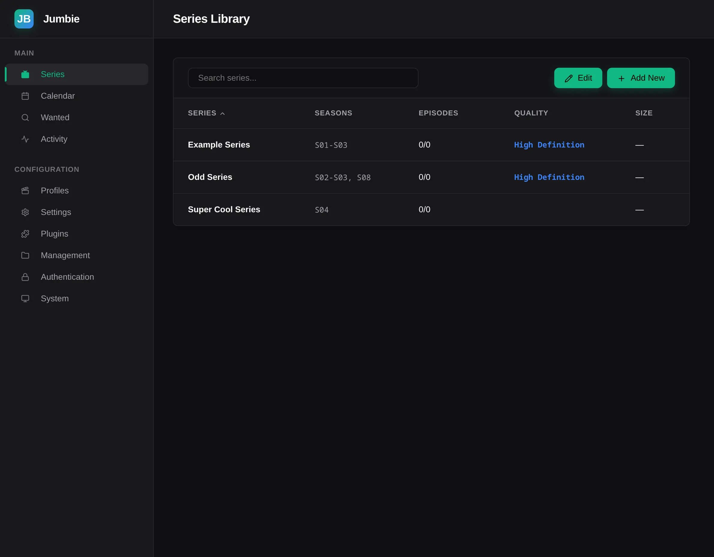

<h1>
  
  Jumbie
</h1>

[](https://github.com/mdeik/Jumbie/actions)

A full-stack TV series media organizer built in Rust. Async HTTP backend (Axum), WASM frontend (Leptos), SQLite database, REST API, plugin system, and Docker deployment. Runs on Linux, Windows, macOS, and Docker.

> New to Jumbie? See the [Getting Started guide](docs/getting-started.md) for installation, first-run setup, and the web UI.



I wanted more control over how episodes are matched and organized than existing tools like Sonarr give you — things like per-season aliases, custom regex patterns for filename parsing, and source-specific search overrides. So I built my own.

---

## What It Covers

- **Systems programming** — async/await, async trait objects, generics, macros, build.rs codegen
- **Full-stack web** — HTTP server with Axum, WASM frontend with Leptos, SQLite with sqlx migrations
- **Async patterns** — background task scheduling, graceful shutdown, rate limiting, parallel I/O
- **Plugin architecture** — JSON-RPC 2.0 protocol, dynamic loading, subprocess management, IPC auth
- **Deployment** — Docker multi-stage builds, compose files, environment-based configuration

---

## What It Does

The app monitors RSS feeds and torrent indexers for new episode releases. When something matches a show you're tracking, it downloads it via qBittorrent, waits for the file to finish, then renames and moves it into your media library with proper naming.

There's a web UI where you can add shows, browse your library, see upcoming episodes on a calendar, and configure everything. The UI adapts to mobile screens at a 946px breakpoint. It runs as a single binary with an embedded frontend.

### Key Features

**Discovery** — Polls RSS feeds (generic) and torrent indexers (Nyaa.si) for new releases. Per-source intervals, automatic search for missing episodes, manual search across all sources.

**Matching** — Filename parsing with regex patterns, per-season aliases, custom regex overrides. Filter rules (required/excluded terms, regex, wildcards) and release profiles that score candidates by resolution, source type, codec, size, and age.

**Downloads** — Queue-based with retry and priority. Integrates with qBittorrent via its Web API. Handles magnet links, torrent files, and direct HTTP links.

**File organization** — Template-based renaming with zero-padding, conditional blocks, date formatting, and media metadata variables. Collision resolution (rename, skip, overwrite) with journal-based crash recovery.

**Content fingerprinting** — xxHash3 for fast content hashing, inode/device tracking for cross-rename detection. ffprobe for media info (codec, resolution, audio, subtitles).

**Metadata** — Episode titles and air dates from TVMaze and TVDB. Background sync with per-provider rate limiting. Supports standard and absolute numbering.

**Authentication** — Admin password (argon2) and scoped API keys (blake3). Write scopes imply read scopes. IP banning with exponential backoff.

**Plugins** — Two architectures: internal plugins compiled into the binary (e.g., Nyaa, qBittorrent, Discord, TVDB) and external plugins as standalone processes in any language via JSON-RPC 2.0 over stdin/stdout.

**Background tasks** — Source polling, media info scanning, download processing, metadata sync, log pruning, auto-search. All tasks respect graceful shutdown via `CancellationToken`.

**Notifications** — Discord webhook integration with template-based messages for download events and errors.

**Calendar** — Token-authenticated iCal feed for displaying scheduled episode releases, with per-token options such as hiding unmonitored series and showing events as all-day.

---

## Project Structure

The project is a Cargo workspace with four crates:

| Crate | Role |
|---|---|
| **`backend/`** | Axum HTTP server, plugin host, SQLite DB layer, source polling, file management |
| **`frontend/`** | Leptos CSR SPA compiled to WASM via Trunk |
| **`crates/shared/`** | Domain types, config, validation, parsing — used by both backend and frontend |
| **`crates/plugin-sdk/`** | Traits and JSON-RPC types for building external plugins |

The backend and frontend share types through the `shared` crate — a field rename in shared causes a compile error everywhere, not a silent mismatch. The plugin SDK is feature-gated so WASM builds don't pull in server-only dependencies.

---

## Tech Stack

| Component | Choice | Rationale |
|---|---|---|
| Language | Rust | Memory safety without a GC, zero-cost abstractions, pattern matching |
| Backend | Axum HTTP server | REST API with scoped endpoints, middleware, and graceful shutdown |
| Frontend | Leptos CSR (WASM) SPA | Fine-grained reactivity, no virtual DOM, communicates with backend via its REST API |
| Database | SQLite via sqlx | Zero-config, async, compile-time query checking |
| API (own) | REST under `/api/` | Scoped by auth role, JSON responses, used by both the web frontend and external clients |
| Third-party APIs | reqwest + source-specific clients | Torrent indexers (Nyaa.si), metadata providers (TVDB, TVMaze), downloaders (qBittorrent Web API), notifiers (Discord webhooks) |
| Auth | argon2 + blake3 | Admin password authentication, scoped API keys with implicit read scopes, IP banning with exponential backoff |
| Rate limiting | governor (GCRA) | Token bucket, no background threads needed |
| Container | Docker multi-stage | Small final image, frontend embedded in binary |

---

## What I Learned

**Async Rust is hard but worth it.** Getting async trait objects to work with the plugin system took a while — `#[async_trait]` and `Box<dyn Trait>` have some gotchas with lifetimes and Send bounds. I learned to think in terms of `Arc<RwLock<>>` shared state and `CancellationToken` for cooperative shutdown.

**Leptos is different from React.** It's fine-grained reactive rather than virtual-DOM based, which means signals update specific DOM nodes instead of diffing the whole tree. The trade-off is more explicit wiring — you have to think about which values are signals and which are plain Rust values.

**SQLite with sqlx is surprisingly ergonomic.** Compile-time query checking catches SQL errors before runtime. The migration system is simple and reliable.

**JSON-RPC over stdin/stdout works well for plugin isolation.** Each plugin is a separate OS process, so a crash doesn't take down the server. The trade-off is serialization overhead and process management complexity (health checks, restarts, timeouts).

**Docker multi-stage builds for WASM + Rust** — building the frontend WASM first, then compiling the backend with the embedded frontend. Keeps the final image small.

---

## Build & Run

### Prerequisites

- Rust
- `wasm32-unknown-unknown` target: `rustup target add wasm32-unknown-unknown`
- Trunk: `cargo install trunk`
- ffprobe (optional, for media info extraction)

### Build

```sh
# Backend only
cargo build -p jumbie

# Frontend only
cd frontend && trunk build --release

# Everything
cargo build --workspace
```

### Run

```sh
# Start Jumbie (API + frontend on port 3000)
cargo run -p jumbie

# Headless server, no system tray (what the Docker image uses)
cargo run -p jumbie --no-default-features

# With Docker
docker compose up
```

### Development

```sh
# Terminal 1: Backend (requires cargo-watch: cargo install cargo-watch)
cargo watch -w backend -x "run -p jumbie"

# Terminal 2: Frontend (sets API_BASE_URL for WASM)
cd frontend && API_BASE_URL=http://localhost:3000 trunk serve --port 8080
```

### CLI Arguments

| Flag | Description |
|---|---|
| `--config <path>` | Custom config file path |
| `--verbose` | Enable debug logging |
| `--no-tray` | Run without the system tray (headless) |
| `--db-stats` | Show database statistics |
| `--vacuum` | Run SQLite VACUUM |
| `--analyze` | Run SQLite ANALYZE |
| `--backup <path>` | Backup database to file |
| `--restore <path>` | Restore database from backup |

---


## API

All endpoints are under `/api/` and grouped by authentication scope. Full documentation is in [`docs/api-docs.md`](docs/api-docs.md).

| Scope | What It Covers |
|---|---|
| Public | Health check, theme |
| Auth | Ban management, API key generation, calendar token management |
| Series Read/Write | CRUD, episodes, files, metadata, reorganize |
| Config Read/Write | Settings, qualities, profiles |
| Plugins Read/Write | Plugin config, schema, testing |
| Files Read/Write | Organized series, import, batch move |
| Queue Read/Write | Download management |
| Search | Manual and auto-search |
| System Read | Health, status, about |
| Activity Read | Activity feed, wanted episodes |
| Logs Read | Log viewer |
| Rename Read/Write | Rename queue, remediation |

---

## Plugin System

Jumbie has a plugin system that lets you add your own sources, download clients, notifiers, or metadata providers without modifying the core code.

There are two ways to write a plugin:

**Internal plugins** are compiled into the Jumbie binary itself. These are written in Rust and live in the backend codebase. Examples include the Nyaa and RSS sources, qBittorrent downloader, Discord notifier, and TVDB/TVMaze metadata providers. This approach gives the best performance but requires you to work with the Rust codebase.

**External plugins** are standalone programs that Jumbie runs as a separate process and talks to over stdin/stdout. They can be written in **any language** — Python, Rust, JavaScript, Bash, whatever you want. Each external plugin lives in its own directory with a `manifest.json` file that tells Jumbie what to run.

See [`docs/plugin-specification.md`](docs/plugin-specification.md) for:
- The four plugin types and what each one does
- Every method your plugin needs to implement
- Step-by-step tutorials for Python and Rust plugins
- How to test your plugin outside of Jumbie
- Best practices for logging, timeouts, and security

The repo also has working example plugins in `examples/plugins/dummy-rust/` (Rust) and `examples/plugins/dummy-python/` (Python) that you can copy as starting points.

---

## Things That Still Need Work

- **More plugin integrations** — currently one downloader (qBittorrent), one notifier (Discord), two sources (Nyaa, RSS), and two metadata providers (TVDB, TVMaze). Every plugin type has at least one built-in integration.
- **Future directions** — metadata integration improvements, multi-library management, and other quality-of-life improvements.

---

## License

AGPL-3.0-only
