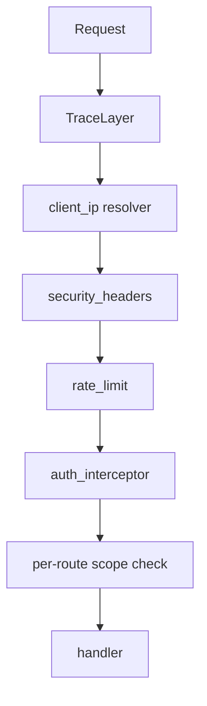

# Jumbie — Authentication & Network Security

> See also: [architecture.md](architecture.md) and [api-docs.md](api-docs.md).

---

## Table of Contents

1. [Overview](#1-overview)
2. [Credentials](#2-credentials)
3. [Request Flow](#3-request-flow)
4. [Client IP Resolution & Trusted Proxies](#4-client-ip-resolution--trusted-proxies)
5. [Authentication Order](#5-authentication-order)
6. [IP Banning](#6-ip-banning)
7. [Rate Limiting](#7-rate-limiting)
8. [Caching](#8-caching)
9. [Memory Reaping](#9-memory-reaping)
10. [Configuration Reference](#10-configuration-reference)
11. [How the Settings Interact](#11-how-the-settings-interact)
12. [Security Notes](#12-security-notes)
13. [Code Map](#13-code-map)

---

## 1. Overview

Authentication is **stateless and per-request**: there is no login endpoint or
session cookie. Every request carries either HTTP Basic credentials (the admin
password) or a Bearer API key, and the middleware decides access before the
request reaches any handler.

Two credential kinds plus two bypass mechanisms are supported:

| Kind | Header | Grants |
|---|---|---|
| Admin password | `Authorization: Basic base64(username:password)` | **All** scopes |
| API key | `Authorization: Bearer jb_<key>` | Only the scopes assigned at creation |
| Localhost bypass | *(none)* | All scopes, when enabled and the client is loopback |
| Subnet whitelist bypass | *(none)* | All scopes, when enabled and the client IP is in the list |

If **no admin password is set**, authentication is disabled entirely and every
request is granted all scopes (fresh-install behaviour).

> **Deployment model:** the ban list, the rate limiter, and the auth caches are
> **per-process**. Jumbie is designed to run as a single instance; multiple
> replicas would each keep their own in-memory state and race on the shared
> `banned_ips` table (last writer wins).

---

## 2. Credentials

### Admin password (Basic)

- The username is ignored; only the password is checked.
- The hash is stored in the `users` table (`argon2id` via the `argon2` crate).
- Basic credentials grant **all** scopes, intended for interactive browser
  sessions.
- An empty stored hash means "no password" → auth disabled.

### API keys (Bearer)

- Format `jb_<url-safe-base64>`, generated with 32 bytes of CSPRNG output.
- Stored as a **BLAKE3 hash** (not Argon2 — API keys are high-entropy, so a cheap
  hash is safe and verifiable on every request). Looked up by hash against an
  index.
- Scopes are assigned at creation; write scopes imply read scopes. See
  [api-docs.md § 11](api-docs.md#11-api-key-scopes).
- Optional expiry (`expires_at`); expired keys are rejected.

### Calendar tokens

Calendar (`cal_...`) tokens are **not** authentication for the API — they only
authorise the `/api/calendar/ical` feed and are passed as a query parameter.

---

## 3. Request Flow

Middleware runs outermost-to-innermost for every request:

- **client_ip resolver** — resolves the client IP *once* (honouring trusted
  proxies) and stores it in request extensions as `ClientIp`. All downstream
  IP-keyed logic reads this shared value, so the ban list and rate limiter can
  never disagree about the client's identity.
- **security_headers** — Host-header validation, CORS, security headers.
- **rate_limit** — per-IP request throttling (before auth, so it also protects
  the unauthenticated login page).
- **auth_interceptor** — credential validation, ban checks, bypasses; injects the
  caller's scopes.
- **scope check** — per-route `from_fn(scope::*)` requiring a specific `ApiScope`.

---

## 4. Client IP Resolution & Trusted Proxies

Everything IP-keyed (banning, rate limiting, localhost/subnet bypass) uses the
IP from the `client_ip` resolver, never the raw socket peer directly.

**Two-tier trust model** (`security.trusted_proxies`):

- **Non-empty** ("production"): `X-Forwarded-For` is trusted only when the TCP
  peer is inside the configured proxies list.
- **Empty** ("dev"): only loopback peers have their `X-Forwarded-For` trusted.

When XFF is trusted, the resolver walks the chain **from the right** and returns
the first entry that is **not** itself a trusted proxy. Taking the rightmost
untrusted value defends against leftmost injection: if a proxy *appends* to XFF
(nginx's `$proxy_add_x_forwarded_for`) rather than overwriting it, a client can
inject arbitrary leftmost values — instead of trusting them, they are skipped.

> **Keep `trusted_proxies` narrow.** Trust is CIDR-based, so any peer inside the
> range is indistinguishable from a real proxy. List the proxies themselves, not
> broad client subnets, and prefer proxies configured to **overwrite**
> `X-Forwarded-For` (`proxy_set_header X-Forwarded-For $remote_addr`) rather than
> append.

---

## 5. Authentication Order

Checks run cheapest-first; bypassed/public requests short-circuit before the one
DB read that determines whether auth is enabled:

1. **Localhost bypass** — `bypass_local_auth` and the resolved client is loopback
   → all scopes.
2. **Subnet whitelist bypass** — `bypass_subnet_whitelist` and the resolved client
   is in `subnet_whitelist` → all scopes.
3. **Public path bypass** — `/api/calendar/ical` and `/api/public/*`.
4. **Auth-disabled check** — reads the admin password hash. A *query error* here
   **fails closed** (401); only a genuinely empty/absent password disables auth.
5. **Ban list** — in-memory lookup; a banned client is rejected (403) *before any
   crypto work*.
6. **Credential validation** — Basic (Argon2) or Bearer (BLAKE3 lookup); both are
   attempted, and unfiltered access requires a valid credential.

Requests with **no** `Authorization` header get `401` without incrementing the
failure counter (so merely loading the login page never counts as a failure).

---

## 6. IP Banning

After `auth.max_auth_fail_count` consecutive failures from one IP, that IP is
banned.

- **Duration** starts at `ban_duration_seconds`.
- **Escalation** (`ban_increment_enabled`): each subsequent ban multiplies the
  previous duration by `ban_increment_factor`, capped at
  `ban_increment_max_seconds`.
- **Forgiveness** (`ban_count_reset_days`): if the last ban is older than this,
  the escalation counter resets, so the next ban starts at the base duration.
- **Reset on success**: a successful authentication clears the IP's failure
  counter (and logs the number cleared).
- **Scope**: the ban is **IP-level** — a banned IP is rejected even if it presents
  valid credentials.
- **Persistence**: bans are written to the `banned_ips` table synchronously, so
  they survive a crash/restart. On startup they are rehydrated into memory; an
  expired temporary ban is kept only for its escalation memory and is represented
  as *not currently banned* (never as a permanent ban).
- **Status codes**: `401` for missing/invalid credentials, `403` for a banned IP.

Bans can also be created/removed manually via the `/api/auth/bans` endpoints.

---

## 7. Rate Limiting

Per-IP **sliding-window counter** over a trailing 60 seconds, applied to **all**
API routes except the public and calendar paths. Each IP tracks the request count
of the current and previous window; the rate is estimated as
`previous × (fraction of the previous window still in the last 60s) + current`.
This avoids the ~2× burst-at-boundary artefact of a naive fixed window.

Enabled with `security.rate_limit_enabled`; the effective limit is
`rate_limit_per_minute + rate_limit_burst`, and exceeding it returns `429`.
Because it runs before auth, it also throttles unauthenticated brute-force
attempts against the login page.

---

## 8. Caching

To avoid a DB round-trip and an Argon2 verification on every request, the auth
layer keeps a small in-memory cache:

| Cache | TTL | Invalidated by | Notes |
|---|---|---|---|
| Admin password hash | 60 s | Password change via the settings API | The "no password" state is **not** cached (no fail-open window) |
| Password verification | 5 min | Password change | Successes only; keyed with a per-process random BLAKE3 key |
| API-key lookup | 60 s | API-key add/edit/remove | Positive hits only; misses fall through to the DB |

Errors are never cached, so a DB failure still fails closed. The password-change
path (`PUT /api/config`) invalidates the password caches.

---

## 9. Memory Reaping

The ban list and rate-limiter maps are keyed by client IP, so they are bounded by
a background reaper (in-memory eviction every 60 s; the DB prune runs every tenth
pass, ~10 min):

- **Ban list** — evicts entries that are not currently banned and have not been
  seen within the escalation window (`ban_count_reset_days`, minimum 1 day).
  Active and permanent bans are always kept. A hard cap (oldest evicted first,
  non-active preferred) backstops a flood of distinct IPs.
- **Rate limiter** — drops entries once **two** windows have elapsed (they no
  longer contribute to the sliding estimate), with a hard cap backstop.
- **Database** — prunes temporary bans that expired beyond the escalation window;
  permanent bans are never pruned.

---

## 10. Configuration Reference

### `auth.*`

| Setting | Default | Effect |
|---|---|---|
| `password` | *(none)* | Argon2 hash of the admin password. Unset ⇒ auth disabled. |
| `max_auth_fail_count` | `5` | Failures before an IP is banned (`0` disables banning). |
| `ban_duration_seconds` | `300` | Base ban duration. |
| `ban_increment_enabled` | `false` | Enable escalating ban durations. |
| `ban_increment_factor` | `2.0` | Multiplier per repeat ban. |
| `ban_increment_max_seconds` | `31536000` | Duration cap (1 year). |
| `ban_count_reset_days` | `30` | Forgiveness window that resets the escalation counter. |
| `bypass_local_auth` | `false` | Skip auth for loopback clients. |
| `bypass_subnet_whitelist` | `false` | Skip auth for IPs in `subnet_whitelist`. |
| `subnet_whitelist` | `[]` | CIDRs for the subnet bypass. |

### `security.*`

| Setting | Default | Effect |
|---|---|---|
| `trusted_proxies` | `[]` | IPs/CIDRs whose `X-Forwarded-For` is trusted. |
| `rate_limit_enabled` | `false` | Enable per-IP rate limiting. |
| `rate_limit_per_minute` | `60` | Requests per window. |
| `rate_limit_burst` | `10` | Extra burst allowance. |
| `host_header_validation` | `false` | Validate the `Host` header against `allowed_domains`. |
| `allowed_domains` | `[]` | Allowed `Host` values. |
| `restrict_cors` | `false` | Restrict CORS to `allowed_origins`. |
| `allowed_origins` | `[]` | CORS allow-list. |
| `clickjacking_protection` / `csrf_protection` / `use_custom_headers` | `false` | Optional response headers. |

---

## 11. How the Settings Interact

| Scenario | Result |
|---|---|
| No password set | All requests granted all scopes; bans/rate limiting still evaluated from memory. |
| Password set + `bypass_local_auth`, loopback client | All scopes, no credential needed. |
| Password set + `bypass_subnet_whitelist`, client in a listed CIDR | All scopes, no credential needed. |
| Behind a trusted proxy | Ban attribution, rate-limit buckets, and bypass checks all use the resolved client IP (XFF), not the proxy. |
| Valid API key from a banned IP | **403** — the IP ban outranks valid credentials. |
| Different client behind the same proxy | Independent ban/failure state and rate-limit bucket. |
| Failed attempts then a success | The IP's failure counter resets (logged). |
| Ban expires, process restarts | The ban stays expired (not promoted to permanent); `ban_count` is retained for escalation. |
| Password changed via settings | Cache invalidated; old password rejected on the next request. |
| DB error reading the password | **401** (fail closed) — never treated as "auth disabled". |

---

## 12. Security Notes

- **Fail closed.** A DB error reading the admin password yields `401`; a DB error
  resolving an API key yields `401`. "Auth disabled" is only ever an *empty*
  stored password.
- **XFF spoofing.** Handled by only trusting XFF from configured proxies and by
  choosing the rightmost untrusted entry. The remaining caveat is proxy
  *misconfiguration* — see § 4.
- **Credential material in memory.** The verification cache stores keyed BLAKE3
  digests under a per-process random key, so the map is not a portable,
  offline-crackable credential store.
- **CORS preflight.** `OPTIONS` requests are handled before auth so browsers
  receive CORS headers even on `401` responses.
- **IP bans are not a substitute for strong passwords** — they slow brute force
  but do not prevent a determined, distributed attacker.

---

## 13. Code Map

| Concern | File |
|---|---|
| Client IP resolution + middleware | `backend/src/middleware/client_ip.rs` |
| Auth middleware (order, banning, bypasses) | `backend/src/middleware/auth.rs` |
| Auth cache (password hash, verification, API keys) | `backend/src/middleware/auth_cache.rs` |
| Rate limiting | `backend/src/middleware/rate_limit.rs` |
| Memory reaper | `backend/src/middleware/reaper.rs` |
| Security headers / CORS / Host validation | `backend/src/middleware/security.rs` |
| Scope checks | `backend/src/middleware/scope.rs` |
| Ban persistence (DB) | `backend/src/db/auth.rs` |
| Ban rehydration on startup | `backend/src/api/router.rs` |
| Password/API-key/ban endpoints | `backend/src/api_routes/auth.rs`, `backend/src/api_routes/bans.rs`, `backend/src/api_routes/settings/config.rs` |

**Tests:** `backend/tests/auth.rs` (credential, bypass, ban, escalation,
rehydration, proxy/XFF, reaper, cache-invalidation, setting combinations),
`backend/tests/api_bans.rs`, `backend/tests/api_rate_limit.rs`, and the
`auth_cache` unit tests in `backend/src/middleware/auth_cache.rs`.
