# Jumbie — Getting Started

Install Jumbie, configure it for the first time, and set up your media library.

---

## Table of Contents

1. [Installation](#installation)
   - [Windows](#windows)
   - [macOS](#macos)
   - [Linux](#linux)
   - [Docker](#docker)
2. [Default Paths by Platform](#default-paths-by-platform)
3. [Portable Mode (`portable.txt`)](#portable-mode-portabletxt)
4. [Config Override (`config.toml`)](#config-override-configtoml)
5. [First Run](#first-run)
6. [Using the Frontend](#using-the-frontend)
   - [Dashboard & Activity](#dashboard--activity)
   - [Series Library](#series-library)
   - [Settings Overview](#settings-overview)
   - [Organization Rules](#organization-rules)
   - [Profiles](#profiles)
   - [Sources](#sources)
   - [Download Clients](#download-clients)
   - [Metadata Providers](#metadata-providers)
   - [Notifications](#notifications)
   - [Authentication](#authentication)
   - [Renames](#renames)
   - [System](#system)

---

## Installation

Download the prebuilt binary for your system from the [releases page](https://github.com/mdeik/Jumbie/releases).

### Windows

#### MSI Installer

**Download:** `jumbie-{version}-windows-x86_64.msi`

1. Download and run the `.msi` installer.
2. Follow the installation prompts.
3. Launch **Jumbie** from the Start Menu.
4. Open your browser to http://localhost:3000.

> **Context menu integration:** The MSI installer adds Jumbie to the **More options** context menu in Windows Explorer.

#### EXE Standalone

**Download:** `jumbie-{version}-windows-x86_64.exe`

1. Download `Jumbie.exe` and place it in any folder you like.
2. Open a terminal (PowerShell or Command Prompt) in that folder:

   ```powershell
   .\Jumbie.exe
   ```
3. Open your browser to http://localhost:3000.

> **Tip:** Create an empty file called `portable.txt` next to `Jumbie.exe` to keep all data inside the same folder. See [Portable Mode](#portable-mode-portabletxt) below.


### macOS

**Download:** `jumbie-{version}-macos-universal.dmg`

1. Download and open the `.dmg` file.
2. Drag **Jumbie** into the **Applications** folder.
3. Launch **Jumbie** from Applications.
4. Open your browser to http://localhost:3000.

> **Gatekeeper note:** The first time you run it, macOS may say the app is from an unidentified developer. Go to **System Settings → Privacy & Security** and click **Open Anyway**, or right-click the app and select **Open**.


### Linux

Pick the package that matches your distro:

#### Tarball (any distro)

**Download:** `jumbie-{version}-linux-{arch}.tar.gz`

```bash
tar -xzf jumbie-{version}-linux-{arch}.tar.gz
sudo mv jumbie /usr/local/bin/
jumbie
```

#### Debian / Ubuntu (`.deb`)

**Download:** `jumbie_{version}_{arch}.deb`

```bash
sudo dpkg -i jumbie_{version}_{arch}.deb
# If you get dependency errors:
sudo apt install -f
jumbie
```

#### Fedora / RHEL (`.rpm`)

**Download:** `jumbie-{version}-1.{arch}.rpm`

```bash
sudo dnf install ./jumbie-{version}-1.{arch}.rpm
jumbie
```

#### AppImage

**Download:** `Jumbie-{version}-{arch}.AppImage`

```bash
chmod +x Jumbie-{version}-{arch}.AppImage
./Jumbie-{version}-{arch}.AppImage
```

The AppImage includes the system tray. On Linux the tray uses the native StatusNotifierItem D-Bus protocol, so it needs no extra shared libraries (no GTK or libxdo) and runs on any modern Linux distribution.

#### Dependency: ffmpeg (all platforms)

Media info extraction requires `ffmpeg` (specifically `ffprobe`, which ships with it):

**Windows:** Download from [ffmpeg.org](https://ffmpeg.org/download.html) and add its `bin` folder to PATH.

**macOS:**
```bash
brew install ffmpeg
```

**Linux:**
```bash
# Debian / Ubuntu
sudo apt install ffmpeg

# Fedora / RHEL
sudo dnf install ffmpeg

# Arch
sudo pacman -S ffmpeg
```

> **Optional but recommended.** Jumbie runs without ffmpeg, but the following features become unavailable:
>
> - **Media info scanning** — The "Enable Background Media Scan" setting is disabled. Episode metadata (duration, resolution, codec, audio channels, etc.) is never extracted automatically or manually.
> - **Episode detail metadata** — The "Media Information" section in the episode detail modal shows nothing (or displays previously-scanned data without allowing re-scans).
> - **Media-info-based automatic profile rules** — Rules that match on media properties (chapters, track count, language, resolution, bitrate, codec, audio channels) are greyed out and cannot be added or modified. Only the "Unexpected Files" rule remains fully editable.
> - **Media-info naming variables** — Template variables such as `${codec}`, `${resolution}`, `${duration}`, `${bitrate}`, `${audio_codec}`, `${audio_channels}`, `${audio_languages}`, `${subtitle_languages}`, `${video_track_count}`, `${audio_track_count}`, `${subtitle_track_count}`, and `${has_chapters}` resolve to empty values in naming formats.
>
> All other functionality (organization, downloads, notifications, metadata providers, authentication, etc.) is unaffected.

### Docker

Requires Docker and Docker Compose.

#### Option 1: Use Docker Compose (recommended)

Download the [`docker-compose.yml`](docker-compose.yml) and run:

```bash
mkdir jumbie && cd jumbie
curl -O https://github.com/mdeik/Jumbie/raw/branch/main/docker-compose.yml
docker compose up -d
```

Open [http://localhost:3000](http://localhost:3000).

The compose file uses the prebuilt image with default settings. Volumes persist your data across container updates.

#### Option 2: Build the image yourself

If you want to build from source or customize the image:

```bash
git clone https://github.com/mdeik/Jumbie.git
cd jumbie
docker compose up --build -d
```

Open [http://localhost:3000](http://localhost:3000).

---

## Default Paths by Platform

| Platform | Database | Plugins | Logs |
|---|---|---|---|
| **Linux** | `~/.local/share/jumbie/jumbie.db` | `~/.local/share/jumbie/plugins` | `~/.local/state/jumbie/logs` |
| **macOS** | `~/Library/Application Support/jumbie/jumbie.db` | `~/Library/Application Support/jumbie/plugins` | `~/Library/Logs/jumbie` |
| **Windows** | `%APPDATA%\jumbie\jumbie.db` | `%APPDATA%\jumbie\plugins` | `%LOCALAPPDATA%\jumbie\logs` |
| **Docker** | `/data/jumbie.db` | `/plugins` | `/logs` |

---

## Portable Mode (`portable.txt`)

Create an empty file called `portable.txt` in the **same directory as the `jumbie` binary**. On any platform, this switches all defaults to relative paths resolved against the binary's location:

```
YourAppFolder/
├── Jumbie.exe           (or just "jumbie" on Linux/macOS)
├── portable.txt          ← empty marker file
├── jumbie/
│   ├── jumbie.db
│   └── plugins/
├── tmp/jumbie/
└── config/
    └── config.toml       (optional override)
```

This is ideal for:
- **USB drives** — carry Jumbie and all its data on a flash drive
- **Network shares** — run it from a NAS-mounted folder
- **Testing** — isolate an instance without touching your system paths

To switch back to native mode, delete `portable.txt`.

---

## Config Override (`config.toml`)

Jumbie runs without a config file, using platform defaults for all paths. To override them, create a `config.toml`.

**Where to put it:**
- **Linux (native):** `~/.config/jumbie/config.toml`
- **macOS (native):** `~/Library/Application Support/jumbie/config.toml`
- **Windows (native):** `<exe_dir>/config/config.toml`
- **Portable mode:** `<exe_dir>/config/config.toml`
- **Docker:** `/config/config.toml`
- **Any platform:** pass `--config /path/to/config.toml` or set `JUMBIE_CONFIG` environment variable

**Example `config.toml`:**

```toml
database = "jumbie/jumbie.db"
unknown_files_tmp_dir = "tmp/jumbie"
plugins_dir = "jumbie/plugins"
logs_dir = "jumbie/logs"
```

Only the four path fields are supported. All other settings (organization rules, sources, download clients, metadata providers, etc.) are managed through the database and configured in the UI.

Relative paths resolve against the executable's directory on every platform.

### Environment Variable Overrides

These override the config file and defaults, and are never written back to `config.toml`:

| Variable | Overrides |
|---|---|
| `JUMBIE_CONFIG` | Config file path |
| `JUMBIE_DATABASE` | Database path |
| `JUMBIE_PLUGINS_DIR` | Plugins directory |
| `JUMBIE_TMP_DIR` | Temporary files directory |
| `JUMBIE_LOGS_DIR` | Logs directory |
| `JUMBIE_LOG_LEVEL` | Log level (`info`, `debug`, `trace`) |
| `JUMBIE_PORT` | HTTP port (default: 3000) |
| `JUMBIE_WORKER_THREADS` | Tokio async worker threads (default: min(4, CPU count)) |
| `JUMBIE_BLOCKING_THREADS` | Tokio blocking thread pool for file/hash I/O (default: 8) |

---

## First Run

Once Jumbie is running, open [http://localhost:3000](http://localhost:3000). You'll go straight to the dashboard — no login screen. **By default there's no password, so everything is open.**

If you're exposing Jumbie outside your local network, set a password first under **Authentication → Account** (see [Authentication](#authentication)).

The UI defaults to **automatic** theme matching your system preference (light/dark). To switch, click **Settings → General** in the sidebar footer and pick **Light**, **Dark**, or **Automatic**.

---

## Using the Frontend

The UI is organized into sections accessible from the sidebar.

### Dashboard & Activity

The dashboard shows system status and a live activity feed — source polls, downloads, file organization, and errors.

<table>
  <tr><th>Desktop</th><th>Mobile</th></tr>
  <tr>
    <td></td>
    <td>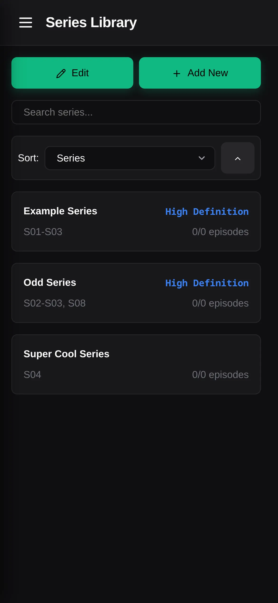</td>
  </tr>
</table>

### Series Library

This is where you manage the shows you're tracking.

**Adding a series:**

1. Click **Add Series** in the top bar.
2. Search for your show by title. Jumbie looks up results from your configured metadata providers (TVDB, TVMaze).
3. Select the matching series. Jumbie pulls in episode titles, air dates, and artwork.
4. Choose a destination root (see [Organization Rules](#organization-rules)).
5. Set monitored status — unmonitored series are skipped during searches.

*Tip: You can also add series directly from supported metadata websites with a single click using the [Add Series UserScript](jumbie-add-series.md).*

<table>
  <tr><th>Desktop</th><th>Mobile</th></tr>
  <tr>
    <td>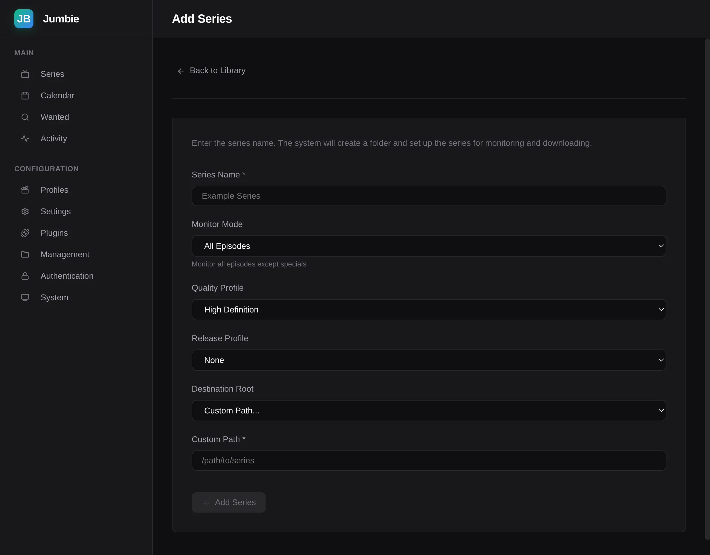</td>
    <td>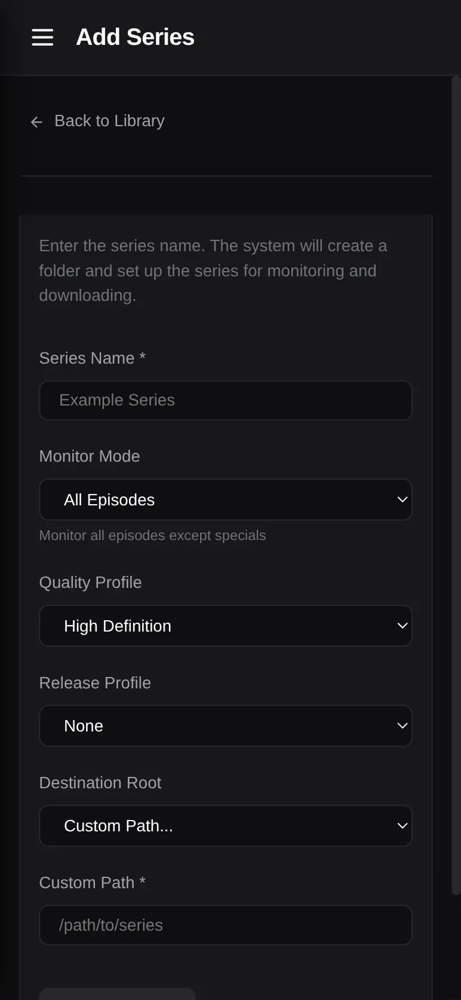</td>
  </tr>
</table>

Once added, you can:
- Browse episodes with their air dates and titles
- Manually trigger a search for missing episodes
- Assign per-series aliases (useful for shows with different naming in different sources)
- Set custom regex overrides for filename parsing


**Edit series:** Click on a series to adjust its title, profiles, and monitor mode.
<table>
  <tr><th>Desktop</th><th>Mobile</th></tr>
  <tr>
    <td>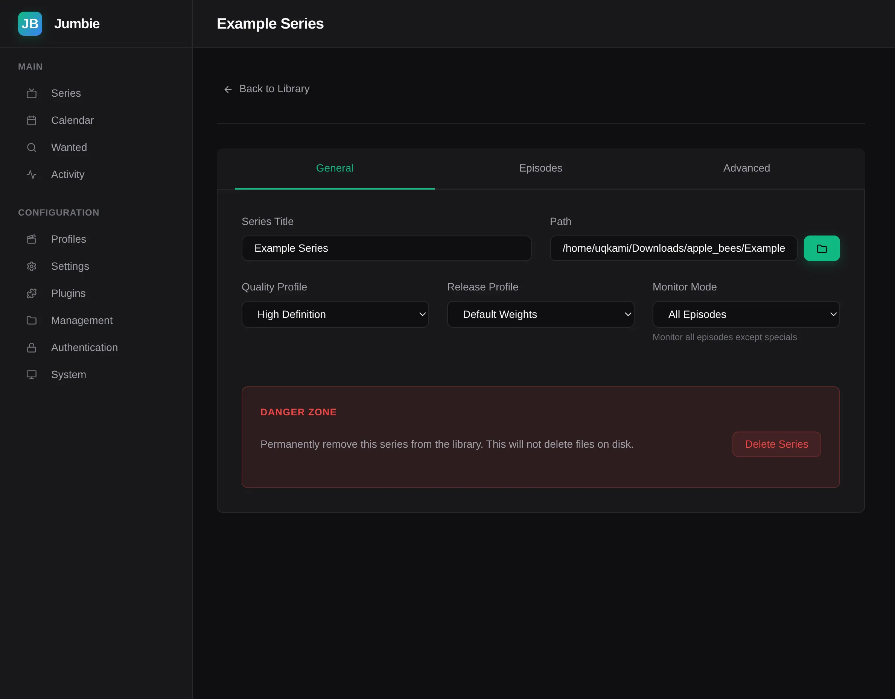</td>
    <td>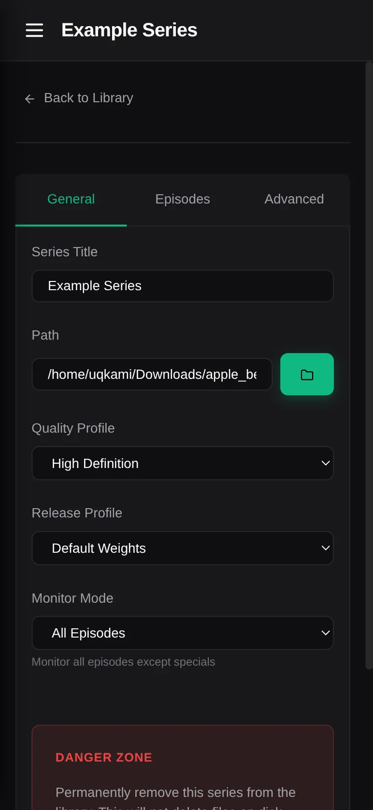</td>
  </tr>
</table>

**Metadata IDs:** Each series needs a metadata provider assigned to provide episode titles and air dates. Before you can assign one to a series, you need a metadata plugin configured and enabled under **Settings → Metadata**. The built-in TVMaze plugin works out of the box — just enable it. **The metadata id field will only appear after a metadata plugin is configured and enabled.**


**Per-series settings:** Each series has a General tab and an Advanced tab for fine-tuning.

<table>
  <tr><th>Desktop</th><th>Mobile</th></tr>
  <tr>
    <td>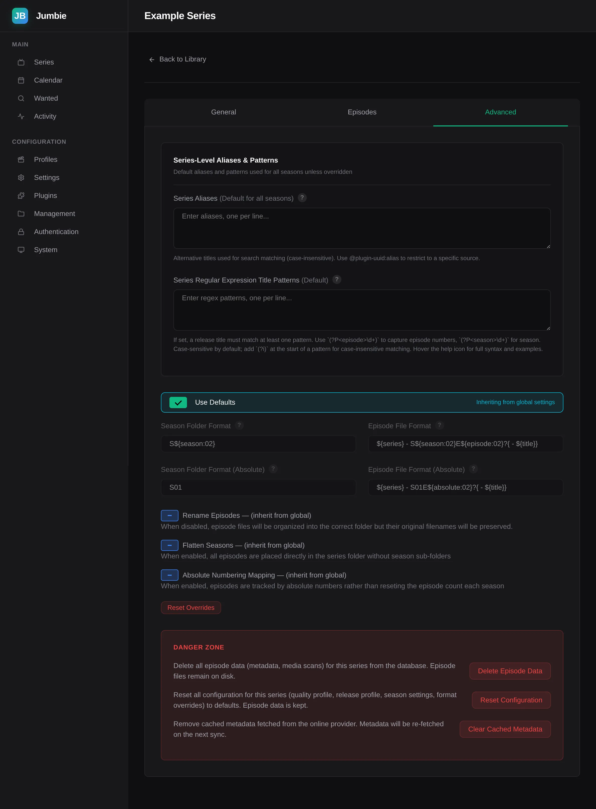</td>
    <td>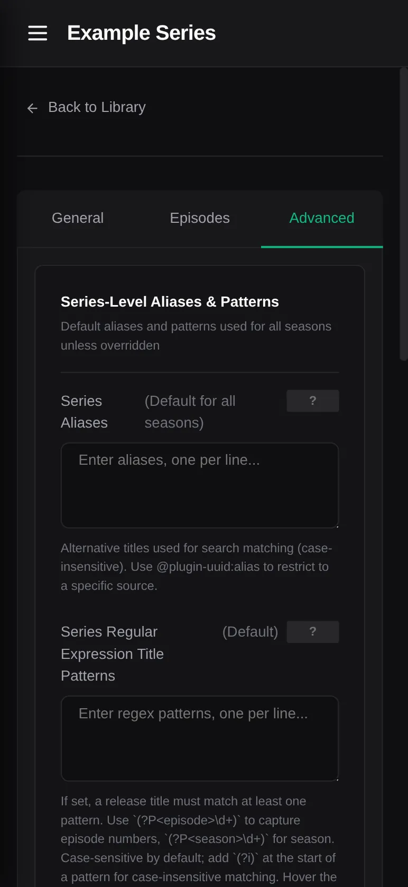</td>
  </tr>
</table>


### Settings Overview

Configuration is organized into sections with sensible defaults, so you can add settings as needed.

#### Organization Rules

This is where you define how Jumbie organizes your files.

**Destination Roots:** A destination root is a base folder where organized episodes go (e.g., `/media/TV` or `D:\Series`). When adding a series, you can select a configured root as its base folder. You can also bypass roots entirely by setting a custom path directly on the series.

<table>
  <tr><th>Desktop</th><th>Mobile</th></tr>
  <tr>
    <td>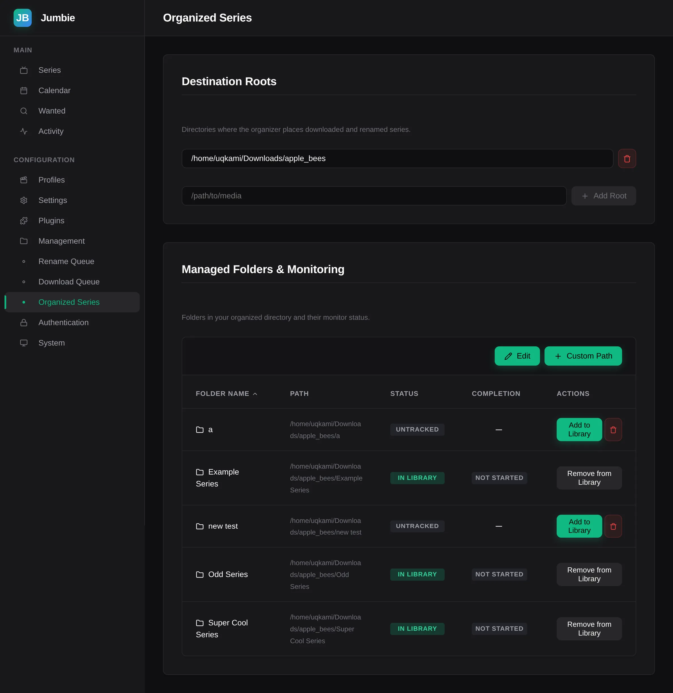</td>
    <td>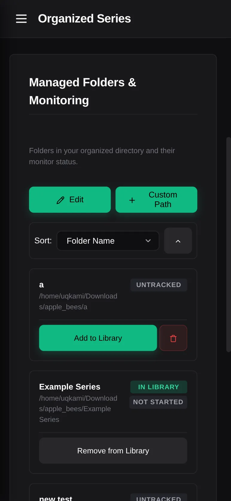</td>
  </tr>
</table>

**Mapping Rules:** A mapping rule defines the folder structure inside a destination root using templates. For example:

```
${series}/Season ${season:auto2}/${series} - S${season:auto2}E${episode:auto2} - ${title}
```

This produces paths like:
```
Sherlock Holmes/Season 01/Sherlock Holmes - S01E01 - Pilot.mkv
```

**Padding:** `${season}` and `${episode}` are written exactly as they are (`5`). Add a width to zero-pad them — `${episode:02}` renders `05` — or use `:auto` to zero-pad to exactly the digits the value needs, with an optional minimum (`:autoN`): `${episode:auto}` sizes to the episode's own season's highest episode (`005` when the season reaches 105, `5` when it tops out at 9), `${episode:auto2}` is the same but never narrower than two digits, and `${season:auto}` sizes to the series' highest season. `:auto2` is the recommended form for absolute-numbered (anime) series, where a fixed `:02` would mix widths (`05` alongside `105`).

You can have multiple rules per root, and override the template per-series from the series detail page.

**Date variables and the server timezone:** Episode filename templates support two date variables — `%{release:FORMAT}` (release/air date) and `%{download:FORMAT}` (download date/time) — using `strftime`-style format strings, e.g. `%{release:%Y-%m-%d}`.

Both render in the **server's local timezone** (the `TZ` environment variable, or the host's system zone if unset) — *not* UTC, and *not* your browser's timezone. Because filenames are written to disk by the server, the server's zone determines the result:

- `%{download:...}` is the moment the file was organized (a real timestamp), so local time is meaningful.
- `%{release:...}` is the release date. When a provider only supplies a date, it is stored at midnight UTC, so a server running in a non-UTC timezone can shift it to the previous or next calendar day.

Set `TZ` on the Jumbie server/container (e.g. `TZ=America/New_York` in Docker) to make generated filenames predictable. All other timestamps in the app are displayed in your browser's timezone; only these filename variables use the server's.

### Profiles

Quality and release profiles are configured under the **Profiles** section in the sidebar (not inside Settings).


**Quality Profiles** define which resolution tiers are acceptable for a series. The default "High Definition" profile accepts 720p, 1080p, and 4K. You can create custom profiles that, for example, limit a series to SD only.

<table>
  <tr><th>Desktop</th><th>Mobile</th></tr>
  <tr>
    <td>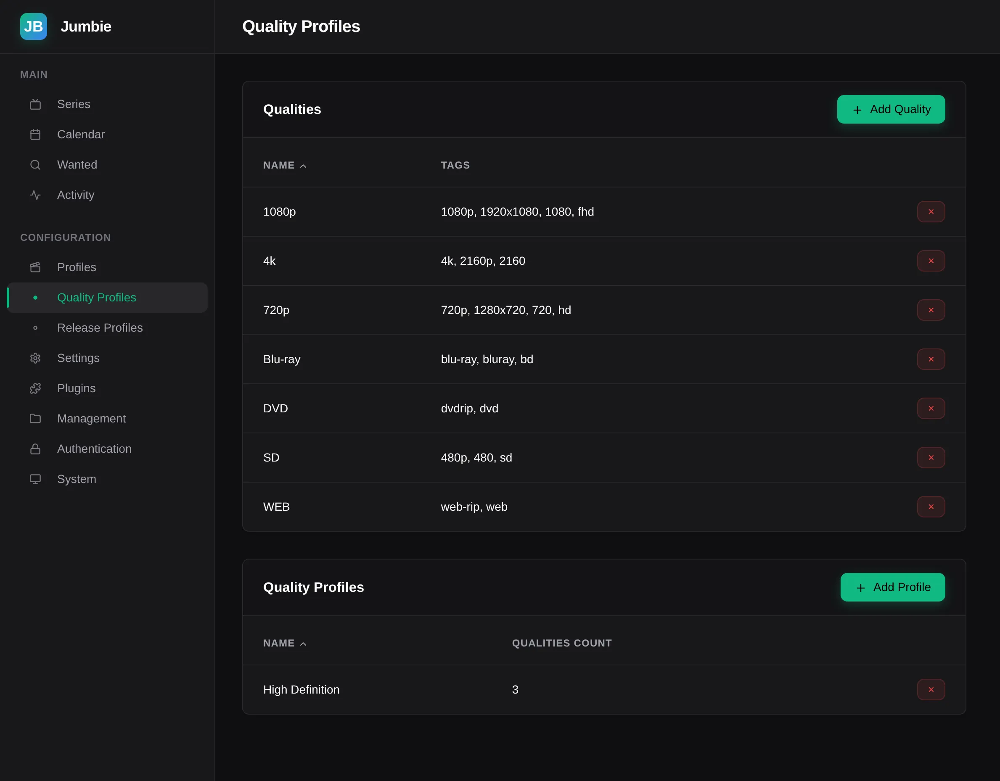</td>
    <td>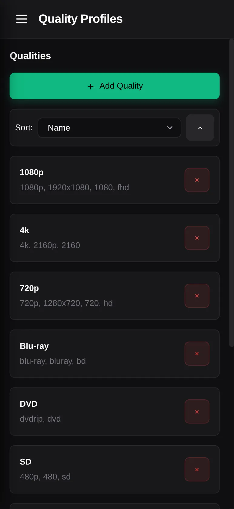</td>
  </tr>
</table>

**Release Profiles** score incoming releases so Jumbie picks the best one. Terms like "BluRay", "WebDL", "1080p" are assigned point values. Releases with higher total scores win. You can set a minimum score to reject low-quality releases entirely.

<table>
  <tr><th>Desktop</th><th>Mobile</th></tr>
  <tr>
    <td>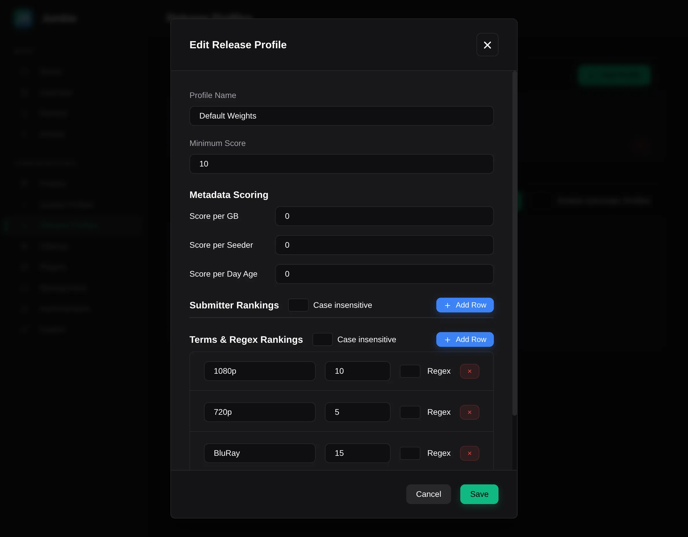</td>
    <td>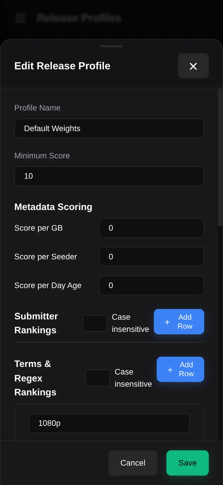</td>
  </tr>
</table>

### Sources

Sources are where Jumbie looks for releases. The built-in sources are:

- **RSS Feed** — Polls a generic RSS/Atom feed. Configure the URL, interval, and category mappings.
- **Nyaa** — Polls Nyaa.si for anime and related content. Supports category filtering.

To set up a source:
1. Go to **Settings → Sources**.
2. Click **Add Source** and choose the type.
3. Configure the URL, polling interval, and any filters.
4. Enable it and Jumbie will start polling on the configured interval.

<table>
  <tr><th>Desktop</th><th>Mobile</th></tr>
  <tr>
    <td>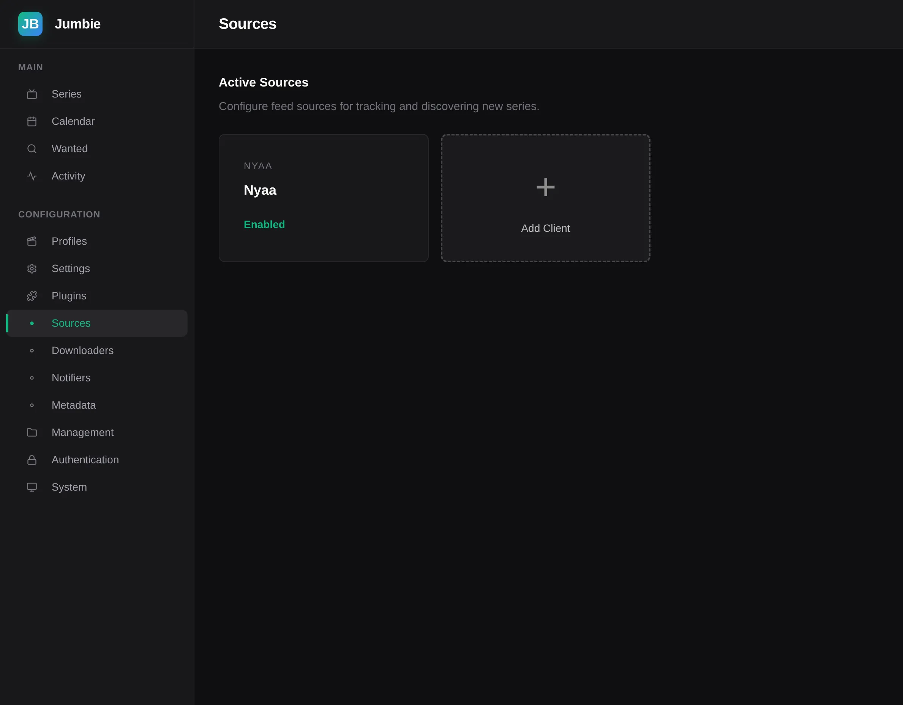</td>
    <td>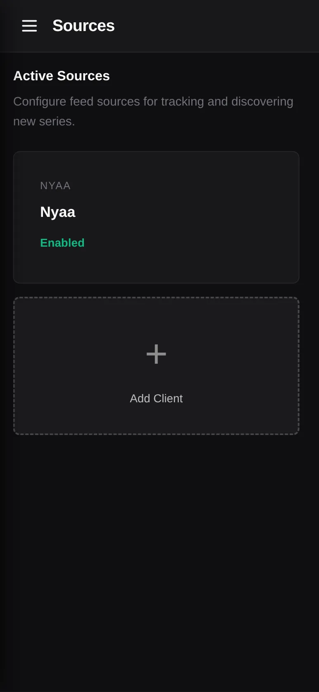</td>
  </tr>
</table>

You can trigger an immediate search from the series detail page or use the manual search feature.

### Download Clients

Jumbie currently supports **qBittorrent** as its download client.

**To set up qBittorrent:**
1. Go to **Settings → Download Clients**.
2. Add a qBittorrent instance with its URL, port, and credentials.
3. Jumbie will connect and monitor downloads through qBittorrent's Web API.

When a matching release is found, Jumbie sends it to qBittorrent. Once the download completes, Jumbie picks up the file and organizes it into your library.

### Metadata Providers

Metadata providers give Jumbie episode titles, air dates, and series artwork.

**Built-in providers:**
- **TVDB** — (**Requires API key**) Series database.
- **TVMaze** — Free API.

To configure: Go to **Settings → Metadata** and enable at least one provider. Each provider can be assigned a priority (higher = preferred when both have data for the same series).

### Notifications

Jumbie can send notifications to Discord when events happen:

- Download started
- Download completed
- File organized
- Error occurred

**To set up Discord notifications:**
1. Go to **Settings → Notifications**.
2. Add a Discord notifier with your webhook URL.
3. Choose which events to send notifications for.

Notifications use customizable templates so you can control the message format.

### Authentication

By default, Jumbie has no password — anyone who can reach the web UI has full access. If you're running it beyond your local network, set a password:

1. Go to **Authentication → Account** and set an admin password.
2. For API access, go to **Authentication → API** to generate scoped API keys.

<table>
  <tr><th>Desktop</th><th>Mobile</th></tr>
  <tr>
    <td>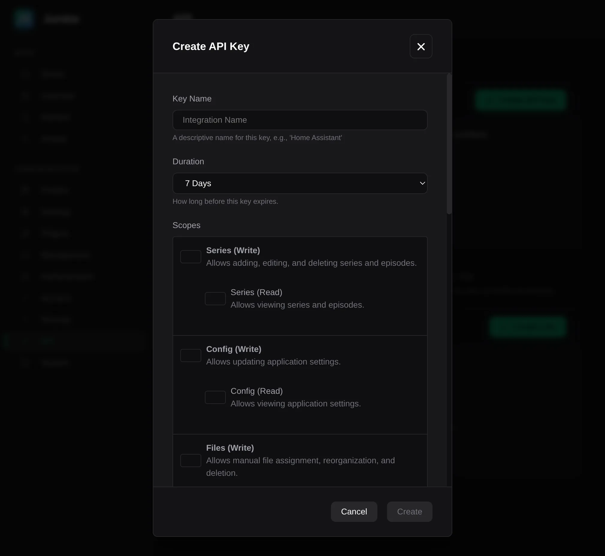</td>
    <td>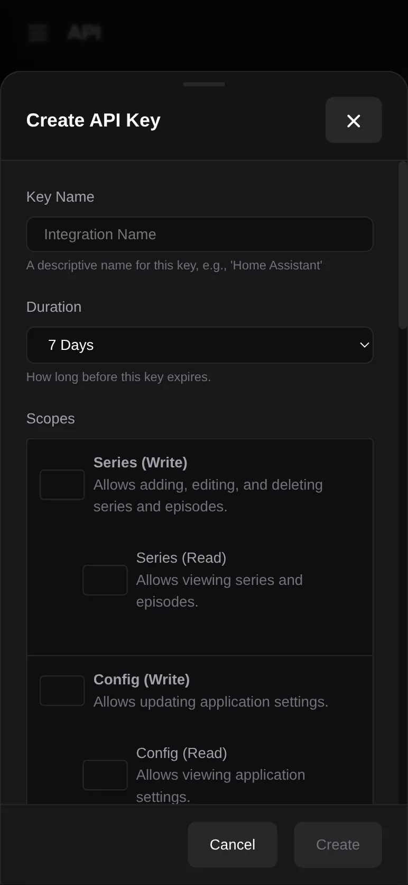</td>
  </tr>
</table>

Scoped keys can limit access to specific operations (e.g., read-only access for external tools).

### Renames

The **Renames** section shows pending and completed file operations. When Jumbie organizes a file, it creates a rename plan that moves/renames the file according to your mapping rules. 

If there's a collision (a file already exists at the destination), Jumbie can: skip, overwrite, or auto-rename. The rename queue shows what's pending and lets you review operations before they execute.

### System

The System section shows:
- **Health** — Database size, background task status, plugin status
- **Logs** — Live log viewer with severity filtering
- **About** — Version, build info, links

<table>
  <tr>
    <th>Desktop</th>
    <th>Mobile</th>
  </tr>
  <tr>
    <td>
      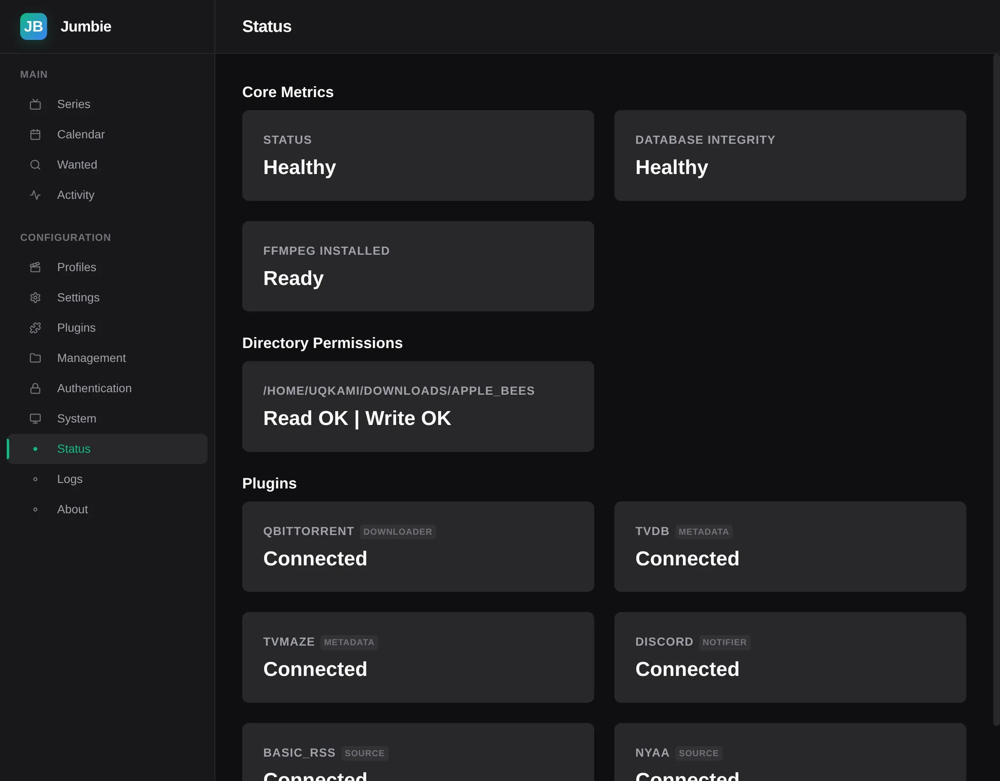
    </td>
    <td>
      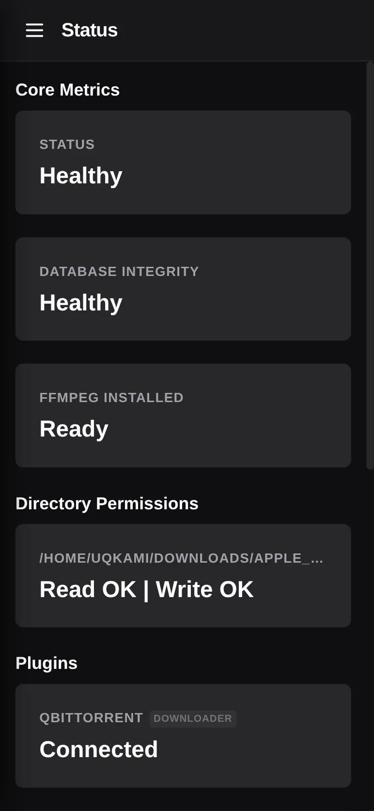
    </td>
  </tr>
</table>

<table>
  <tr>
    <th>Desktop</th>
    <th>Mobile</th>
  </tr>
  <tr>
    <td>
      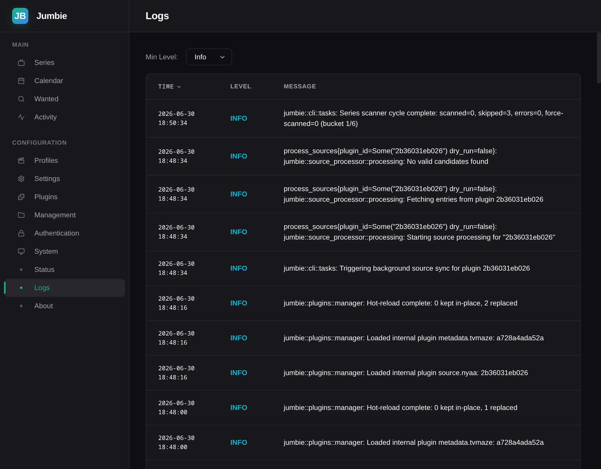
    </td>
    <td>
      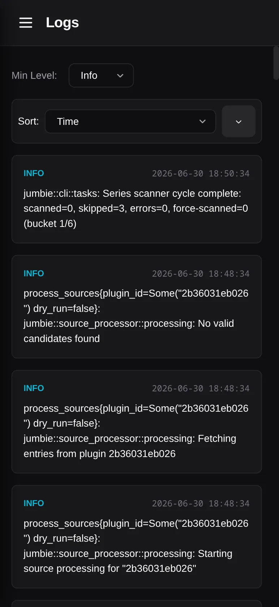
    </td>
  </tr>
</table>

---

## CLI Reference

Unnecessary for normal operation — only needed for development or advanced usage.

| Flag | Description |
|---|---|
| `--config <path>` | Custom config file path |
| `--verbose` | Enable debug logging |
| `--db-stats` | Show database statistics |
| `--vacuum` | Run SQLite VACUUM (reclaim space) |
| `--analyze` | Run SQLite ANALYZE (update statistics) |
| `--backup <path>` | Backup database to file |
| `--restore <path>` | Restore database from backup |

---

## Diving Deeper

- [API Documentation](api-docs.md) — Full REST API reference
- [Plugin Specification](plugin-specification.md) — Write your own plugins
- [Architecture Guide](architecture.md) — How Jumbie works under the hood
- [Images](images/) — A collection of screenshots
